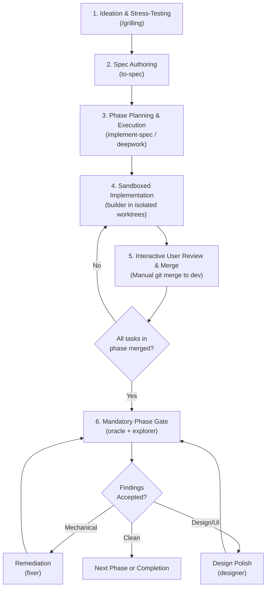

# Antigravity Skills & Multi-Agent Orchestration

An opinionated collection of custom skills and specialized subagents for **Google Antigravity**.

This repository defines an isolated, multi-agent development workflow tailored for complex, high-risk coding tasks. It combines Socratic design discovery, structured specifications, vertical-slice implementation in isolated git worktrees, OS-native command sandboxing, and rigorous review gates.

---

## Architecture & Principles

This workflow is built natively on Google Antigravity primitives:

1. **Native Worktree Isolation (`workspace: branch`)**:
   - Each implementation task executes in an ephemeral, isolated git worktree branching directly from `dev`.
   - Never stacks branches from unmerged tasks; dependent tasks wait until prior work merges into `dev`.
2. **OS-Native Sandboxing (`commandExecutionPolicy: sandbox`)**:
   - Implementation and fixing agents execute in a hardened environment (Linux kernel namespaces / macOS Seatbelt).
   - Paired with `autoExecutionPolicy: proceed-in-sandbox`: commands within the sandbox run without prompts; host mutations and remote Git (`git push`) require explicit approval.
   - Read-only inspection utilities (`grep`, `tail`, `head`, `cat`, `find`, `wc`, `git status/log/diff/show`) are auto-approved globally.
   - Network access is denied by default; tasks receive access only via explicit allowlists.
   - Git commits occur host-side after the sandboxed run reports success; credentials are never passed into the sandbox.
3. **Vertical Slices over Horizontal Layers**:
   - Tasks touch full vertical slices (e.g., database schema + backend endpoint + frontend component) rather than batching horizontal layers.
   - Every task yields an independently runnable and testable increment.
4. **Human-in-the-Loop Verification**:
   - Implementations are manually inspected and interactively validated by the user before merging.
   - Merging into `dev` is always an explicit user action—never automated by agents.

---

## Directory Structure

```
.
├── agents/                         # Specialist subagent definitions
│   ├── builder.md                  # Sandboxed task implementer
│   ├── designer.md                 # UI/UX specialist
│   ├── explorer.md                 # Structural & dependency boundary scanner
│   ├── fixer.md                    # Sandboxed mechanical follow-up
│   ├── librarian.md                # Fact-grounded codebase & external researcher
│   └── oracle.md                   # Reviewer for bugs, security & maintainability
├── docs/                           # Architectural design documents (gitignored)
│   └── agentic-workflow-spec.md    # Design rationale & platform research
├── skills/                         # High-level workflows & orchestrators
│   ├── deepwork/
│   │   └── SKILL.md                # Multi-phase, gated orchestrator workflow
│   ├── grilling/
│   │   └── SKILL.md                # Socratic design-tree interviewer
│   ├── implement-spec/
│   │   └── SKILL.md                # Execution orchestrator for medium tasks
│   ├── setup-worktree/
│   │   └── SKILL.md                # Environment hydration automation
│   └── to-spec/
│       └── SKILL.md                # Testable specification authoring
└── README.md
```

---

## Skills

Skills extend the orchestrating agent with structured protocols:

### [`deepwork`](skills/deepwork/SKILL.md)
High-cost orchestrator workflow for large, high-risk, multi-phase coding efforts.
- **Contract**: The invoking agent acts strictly as a scheduler/manager, delegating code changes exclusively to `builder` and follow-ups to `fixer` or `designer`.
- **Session State**: Tracks phase progression, worktree branches, and gate outcomes in an ephemeral, gitignored file (`docs/deepwork/<task-slug>.md`).
- **Phase Execution**: Dispatches parallel-safe tasks concurrently in isolated worktrees (`workspace: branch`).
- **Phase Gates**: Dispatches `oracle` (and optionally `explorer`) to evaluate the full changed surface once all phase tasks merge to `dev`. Enforces a strict budget of at most 2 re-reviews.

### [`grilling`](skills/grilling/SKILL.md)
Socratic design-tree interview protocol to stress-test ideas and uncover hidden assumptions.
- **Design Tree Frontier**: Formulates decisions as branching trees, asking the frontier of unblocked questions in batched rounds with recommended options.
- **Zero-Guessing Invariant**: Agent dispatches research for environment facts rather than asking the user, reserving user questions strictly for design decisions.
- **Outcome**: Finishes only when the frontier is empty and a complete shared understanding is confirmed.

### [`to-spec`](skills/to-spec/SKILL.md)
Authors focused, testable feature specifications at `docs/specs/<slug>/spec.md` by synthesizing the current conversation (no interview required).

### [`implement-spec`](skills/implement-spec/SKILL.md)
Plans and executes medium-sized features based on a spec. A lightweight alternative to `deepwork` that runs sequentially in the current `Workspace: inherit` environment.

### [`setup-worktree`](skills/setup-worktree/SKILL.md)
Analyzes the tech stack and writes an environment hydration script to `.gemini/worktree-setup.md`, ensuring all branched worktrees possess the right dependencies (like `.venv` or `node_modules`).

---

## Specialist Subagents

Configured in `agents/` with tailored permissions, tools, and model tiers:

| Agent | Model | Sandboxed | Primary Role |
| :--- | :--- | :---: | :--- |
| **[`builder`](agents/builder.md)** | `flash` | Yes | Executes task-level code changes in isolated worktrees (`workspace: branch`). Makes the smallest possible diff satisfying the task brief. |
| **[`oracle`](agents/oracle.md)** | `pro` | No | Read-only reviewer evaluating the full changed surface across bugs, security, maintainability, and regression risk. |
| **[`designer`](agents/designer.md)** | `pro` | No | UI/UX authority for layout, rhythm, motion, color, affordances, component feel, and responsive behaviors. |
| **[`fixer`](agents/fixer.md)** | `flash` | Yes | Sandboxed mechanical remediation (wiring, unit tests, typing, non-visual bugfixes) for accepted findings. |
| **[`librarian`](agents/librarian.md)** | `pro` | No | Deep research on unfamiliar dependencies, libraries, APIs, or codebase architecture. Cites exact `file:line` locations and external documentation. |
| **[`explorer`](agents/explorer.md)** | `flash` | No | Read-only structural analysis of module boundaries, dependency directions, and file placements following phase changes. |

---

## Workflow Lifecycle

A typical complex feature lifecycle follows these stages:



1. **Clarify Intent**: Run `/grilling` to resolve design ambiguities and settle constraints.
2. **Define the Spec**: Run `to-spec` to synthesize the discussion into testable criteria in `docs/specs/<slug>/spec.md`.
3. **Plan & Decompose**: Initialize `implement-spec` (for medium tasks) or `deepwork` (for massive features) to break the feature into vertical-slice tasks.
4. **Implement in Sandboxes**: Dispatch `builder` subagents into isolated worktrees (`workspace: branch`) with network denied by default.
5. **Verify & Merge**: User checks out the branch, tests it interactively, and merges into `dev`.
6. **Evaluate Phase Gate**: Run `oracle` against the phase's cumulative diff (max 2 re-reviews). Route fixes to `fixer` (mechanical) or `designer` (visual).
