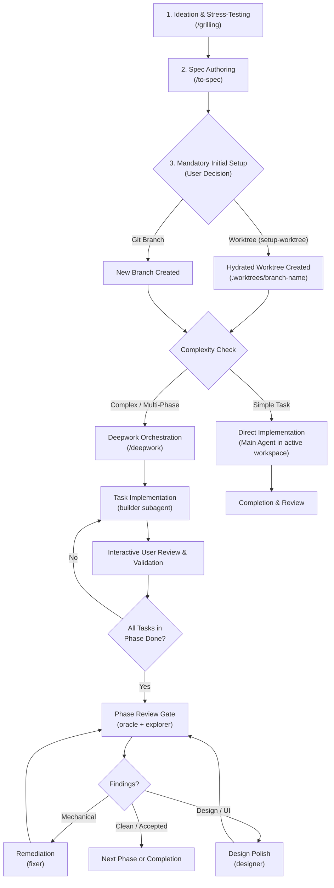

# Antigravity Skills & Multi-Agent Orchestration

An opinionated collection of custom skills and specialized subagents for **Google Antigravity**.

This repository defines an isolated, multi-agent development workflow tailored for complex, high-risk coding tasks. It combines Socratic design discovery, structured specifications, workspace preparation in hydrated worktrees or branches, OS-native command sandboxing, and rigorous review gates.

---

## Architecture & Principles

This workflow is built natively on Google Antigravity primitives:

1. **Mandatory Initial Setup (User Decision: Worktree or Branch)**:
   - Before implementation begins, a **mandatory initial phase** prepares the isolated environment: either a dedicated **git worktree** (created and hydrated via `setup-worktree`) or a standard **git branch**.
   - The user decides which mechanism to use based on project needs and workflow preferences.
   - Implementation subagents run directly in the prepared environment (`workspace: inherit`), preserving all pre-hydrated dependencies (such as `.venv` or `node_modules`) without duplicating environment overhead.
2. **OS-Native Sandboxing Across All Subagents (`commandExecutionPolicy: sandbox`)**:
   - **All subagents execute within a hardened sandbox environment** (Linux kernel namespaces / macOS Seatbelt).
   - Paired with `autoExecutionPolicy: proceed-in-sandbox`: commands within the sandbox run without prompts; host mutations and remote Git (`git push`) require explicit approval.
   - Read-only inspection utilities (`grep`, `tail`, `head`, `cat`, `find`, `wc`, `git status/log/diff/show`) are auto-approved globally.
   - Network access is denied by default; tasks receive access only via explicit allowlists.
   - Git commits occur host-side after the sandboxed run reports success; credentials are never passed into the sandbox.
3. **Vertical Slices over Horizontal Layers**:
   - Tasks touch full vertical slices (e.g., database schema + backend endpoint + frontend component) rather than batching horizontal layers.
   - Every task yields an independently runnable and testable increment.
4. **Human-in-the-Loop Verification**:
   - Implementations are manually inspected and interactively validated by the user before merging.
   - Merging into `dev` or `main` is always an explicit user action—never automated by agents.

---

## Directory Structure

```
.
├── agents/                         # Specialist subagent definitions
│   ├── builder.md                  # Sandboxed task implementer
│   ├── designer.md                 # Sandboxed UI/UX specialist
│   ├── explorer.md                 # Sandboxed structural & dependency boundary scanner
│   ├── fixer.md                    # Sandboxed mechanical follow-up
│   ├── librarian.md                # Sandboxed codebase & external researcher
│   └── oracle.md                   # Sandboxed reviewer for bugs, security & maintainability
├── skills/                         # High-level workflows & orchestrators
│   ├── deepwork/
│   │   └── SKILL.md                # Multi-phase, gated orchestrator workflow
│   ├── domain-modeling/
│   │   └── SKILL.md                # Domain model & vocabulary definition
│   ├── grill-with-docs/
│   │   └── SKILL.md                # Design interview producing ADRs & glossary
│   ├── grilling/
│   │   └── SKILL.md                # Socratic design-tree interviewer
│   ├── setup-worktree/
│   │   └── SKILL.md                # Worktree creation & environment hydration
│   └── to-spec/
│       └── SKILL.md                # Testable specification authoring
└── README.md
```

---

## Skills

Skills extend the orchestrating agent with structured protocols:

### [`setup-worktree`](skills/setup-worktree/SKILL.md)
Creates a new git worktree inside the project directory and automatically hydrates its environment for immediate implementation.
- **Preparation**: Confirms the target branch name and ensures the worktree directory (`/.worktrees/`) is ignored in `.gitignore`.
- **Worktree Creation**: Creates the worktree directly within `.worktrees/<branch-name>`.
- **Environment Hydration**: Inspects the project tech stack (Python, Node.js, Rust, env files) and executes fast copying of existing environments (e.g., `cp -a .venv ...`, `cp -a node_modules ...`, `.env`).
- **Use Case**: Used during the mandatory initial phase when an isolated worktree is preferred over a simple branch.

### [`deepwork`](skills/deepwork/SKILL.md)
High-cost orchestrator workflow for large, high-risk, multi-phase coding efforts.
- **Contract**: The invoking agent acts strictly as a scheduler/manager, delegating code changes exclusively to `builder` and follow-ups to `fixer` or `designer`.
- **Session State**: Tracks phase progression, task statuses, and gate outcomes in an ephemeral, gitignored tracking file.
- **Phase Execution**: Coordinates implementation tasks across phases with clear dependency boundaries.
- **Phase Gates**: Dispatches `oracle` (and optionally `explorer`) to evaluate the full changed surface once all phase tasks complete. Enforces a strict budget of at most 2 re-reviews.

### [`to-spec`](skills/to-spec/SKILL.md)
Authors focused, testable feature specifications by synthesizing the current conversation (no interview required).
- Captures problem statement, user stories, implementation decisions, and testing criteria.
- **Direct Implementation Path**: For simple tasks, authoring the spec with `/to-spec` and instructing the main agent to implement it directly is the recommended lightweight path (no heavy orchestrator needed).

### [`grilling`](skills/grilling/SKILL.md)
Socratic design-tree interview protocol to stress-test ideas and uncover hidden assumptions.
- **Design Tree Frontier**: Formulates decisions as branching trees, asking the frontier of unblocked questions in batched rounds with recommended options.
- **Zero-Guessing Invariant**: Agent dispatches research for environment facts rather than asking the user, reserving user questions strictly for design decisions.
- **Outcome**: Finishes only when the frontier is empty and a complete shared understanding is confirmed.

### [`domain-modeling`](skills/domain-modeling/SKILL.md)
Builds and sharpens a project's domain model, vocabulary, and architectural decision records (ADRs) as design progresses.

### [`grill-with-docs`](skills/grill-with-docs/SKILL.md)
Combines Socratic design interviewing with domain modeling to stress-test plans while capturing ADRs and domain glossaries.

---

## Specialist Subagents

Configured in `agents/` with tailored permissions, tools, and model tiers. **All subagents run sandboxed** within Antigravity's OS-native sandbox:

| Agent | Model | Sandboxed | Primary Role |
| :--- | :--- | :---: | :--- |
| **[`builder`](agents/builder.md)** | `pro` | Yes | Executes task-level code changes in the active workspace (`workspace: inherit`). Makes the smallest possible diff satisfying the task brief. |
| **[`oracle`](agents/oracle.md)** | `pro` | Yes | Read-only reviewer evaluating the full changed surface across bugs, security, maintainability, and regression risk. |
| **[`designer`](agents/designer.md)** | `pro` | Yes | UI/UX authority for layout, rhythm, motion, color, affordances, component feel, and responsive behaviors. |
| **[`fixer`](agents/fixer.md)** | `flash` | Yes | Bounded mechanical remediation (wiring, unit tests, typing, non-visual bugfixes) for accepted findings. |
| **[`librarian`](agents/librarian.md)** | `pro` | Yes | Fact-grounded codebase and external research. Cites exact `file:line` locations and official documentation. |
| **[`explorer`](agents/explorer.md)** | `flash` | Yes | Read-only structural analysis of module boundaries, dependency directions, and file placements following phase changes. |

---

## Workflow Lifecycle

A typical feature lifecycle follows these stages:



1. **Clarify Intent**: Run `/grilling` to resolve design ambiguities, explore trade-offs, and settle constraints.
2. **Define the Spec**: Run `/to-spec` to synthesize the discussion into testable user stories and criteria.
3. **Mandatory Initial Setup (User Decides)**:
   - **Worktree**: Run `/setup-worktree` to generate `.worktrees/<branch-name>` and hydrate dependencies (`.venv`, `node_modules`, `.env`).
   - **Branch**: Alternatively, create and check out a dedicated git branch directly.
4. **Choose Execution Path**:
   - **Simple Tasks**: Ask the main agent to implement the spec directly within the active workspace. No orchestrator overhead needed.
   - **Complex Tasks**: Activate `/deepwork` for multi-phase planning, coordinating sandboxed subagents across phased gates.
5. **Implement in Sandbox**: For deepwork, dispatch `builder` subagents (`workspace: inherit`) with network denied by default to execute focused vertical slices.
6. **Verify & Validate**: User inspects changes interactively and validates functionality before merging.
7. **Evaluate Phase Gate**: Run `oracle` against cumulative phase diffs (max 2 re-reviews). Route findings to `fixer` (mechanical) or `designer` (visual).
